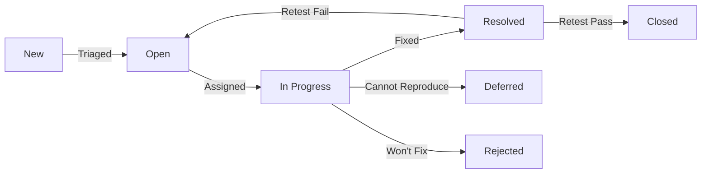

# VWO Login Page — Master Test Plan

---

## 1. Test Plan Identifier

| Attribute | Value |
|---|---|
| **Plan ID** | VWO-LOGIN-TP-001 |
| **Version** | 1.0 |
| **Date** | 2026-08-08 |
| **Author** | QA Architect — AITester Blueprint 4x |
| **Status** | Approved |
| **Approval Authority** | QA Director / CTO |

---

## 2. Introduction

### 2.1 Purpose

This document defines the master test plan for the **VWO Login Page** hosted at `https://app.vwo.com/#/login`. It establishes the testing strategy, scope, resources, schedule, and deliverables required to validate that the login page meets functional, non-functional, security, accessibility, and compliance requirements at an enterprise-grade level.

### 2.2 Scope

The testing effort encompasses:

- **In Scope**: Email/password authentication, Google OAuth 2.0 SSO, Microsoft Azure AD SSO, "Forgot Password" recovery, "Create Account" navigation, session management (timeout, Remember Me), CAPTCHA enforcement, rate limiting, client-side validation, API integration, UI/UX, accessibility (WCAG 2.1 AA), cross-browser/cross-device compatibility, performance, and security of the login page.
- **Out of Scope**: Post-authentication features (dashboard, campaign management, reporting, settings), backend microservices not directly serving the login flow, payment processing, third-party integrations beyond Google and Microsoft SSO.

### 2.3 Objectives

| ID | Objective | Success Metric |
|---|---|---|
| OBJ-01 | Validate all three authentication methods work end-to-end | 100% pass rate on happy-path tests |
| OBJ-02 | Ensure security controls prevent unauthorized access | Zero critical/high security defects at release |
| OBJ-03 | Achieve WCAG 2.1 AA compliance | Zero WCAG Level A/AA violations |
| OBJ-04 | Meet performance benchmarks | Login page load < 3s (P95), API auth < 2s (P95) |
| OBJ-05 | Guarantee cross-browser/cross-device compatibility | 100% pass across defined browser matrix |
| OBJ-06 | Validate GDPR-compliant data handling | No PII leakage in logs, cookies, or network calls |

---

## 3. Test Items

### 3.1 Items in Scope

| Item ID | Component | Description |
|---|---|---|
| TI-01 | Login Page UI | SPA rendering, form elements, labels, buttons, links, error containers |
| TI-02 | Email/Password Auth | Credential submission, server-side validation, token generation |
| TI-03 | Google OAuth 2.0 SSO | Redirect to Google consent screen, token exchange, callback handling |
| TI-04 | Microsoft Azure AD SSO | Redirect to Microsoft login, token exchange, callback handling |
| TI-05 | Forgot Password Flow | Email submission, reset link generation, token expiry, password reset |
| TI-06 | CAPTCHA | Trigger after N failed attempts, challenge completion, bypass prevention |
| TI-07 | Rate Limiting | Per-IP and per-account throttling, lockout messaging, cooldown |
| TI-08 | Session Management | Token issuance, Remember Me persistence, idle timeout, logout invalidation |
| TI-09 | HTTPS/TLS | Certificate validity, HSTS headers, mixed content prevention |
| TI-10 | Client-Side Validation | Email format, required fields, max lengths, XSS/SQLi sanitization |

### 3.2 Items Out of Scope

| Item ID | Component | Rationale |
|---|---|---|
| TO-01 | Post-login dashboard | Separate test plan; dependent on successful login |
| TO-02 | Account registration flow | Separate feature with its own test plan |
| TO-03 | Billing/payment | Not part of login page |
| TO-04 | Internal admin panel auth | Different auth domain |
| TO-05 | Mobile native apps | Web-only scope; native apps tested separately |

---

## 4. Features to be Tested

| Feature ID | Feature | Priority | Auth Method |
|---|---|---|---|
| F-01 | Login with valid email and password | P0 — Critical | Email/Password |
| F-02 | Login with Google SSO (authorized account) | P0 — Critical | Google OAuth |
| F-03 | Login with Microsoft SSO (authorized account) | P0 — Critical | Microsoft Azure AD |
| F-04 | Invalid password error handling | P0 — Critical | Email/Password |
| F-05 | Unregistered email error handling | P0 — Critical | Email/Password |
| F-06 | Empty field validation (client-side) | P1 — High | All |
| F-07 | Forgot Password — valid email submission | P1 — High | Email/Password |
| F-08 | Forgot Password — reset link received and functional | P1 — High | Email/Password |
| F-09 | CAPTCHA trigger after N failed attempts | P1 — High | Email/Password |
| F-10 | Rate limiting / account lockout | P1 — High | Email/Password |
| F-11 | Remember Me — persistent session | P1 — High | All |
| F-12 | Session timeout — automatic logout | P1 — High | All |
| F-13 | Browser back button after logout | P2 — Medium | All |
| F-14 | HTTPS enforcement (HTTP → HTTPS redirect) | P1 — High | All |
| F-15 | XSS payload rejection in form fields | P1 — High | All |
| F-16 | SQL injection rejection in form fields | P1 — High | All |
| F-17 | CSRF token validation | P1 — High | All |
| F-18 | Password field masking | P2 — Medium | Email/Password |
| F-19 | Tab order and keyboard navigation | P2 — Medium | All |
| F-20 | Screen reader compatibility (NVDA/VoiceOver) | P2 — Medium | All |
| F-21 | Color contrast (WCAG AA 4.5:1 ratio) | P2 — Medium | All |
| F-22 | Mobile responsive layout (320px–428px) | P2 — Medium | All |
| F-23 | Cross-browser rendering | P2 — Medium | All |
| F-24 | Page load performance (< 3s) | P1 — High | All |
| F-25 | API response time (< 2s) | P1 — High | All |
| F-26 | Google SSO — denied consent handling | P1 — High | Google OAuth |
| F-27 | Microsoft SSO — canceled auth handling | P1 — High | Microsoft Azure AD |
| F-28 | Create Account link navigation | P3 — Low | All |
| F-29 | Concurrent session from multiple browsers | P2 — Medium | All |
| F-30 | GDPR cookie consent banner | P1 — High | All |

---

## 5. Features Not to be Tested

| Feature | Rationale |
|---|---|
| Dashboard/Campaign CRUD | Post-authentication; separate test plan |
| User profile management | Post-authentication feature |
| Billing & subscription | Separate module |
| API endpoints not serving login | Out of scope for login page testing |
| SSO with providers other than Google/Microsoft | Not supported per current public documentation |
| SAML-based SSO | Not publicly advertised on VWO login page |
| Multi-factor authentication (MFA) | Not observed on current login page; may be org-configurable |

---

## 6. Test Strategy / Approach

### 6.1 Test Levels

| Level | Description | Owner | Tools |
|---|---|---|---|
| **Unit** | Individual components (input validators, formatters, token parsers) | Developers | Jest, React Testing Library |
| **Integration** | API contract tests (auth endpoints, SSO callbacks) | Dev + QA | Postman, Pact |
| **System** | End-to-end login flows across all auth methods | QA Team | Playwright, Cypress |
| **UAT** | Business user acceptance of login experience | Product Owner + QA | Manual, Playwright |

### 6.2 Test Types

| Type | Description | Technique |
|---|---|---|
| **Functional** | Validate all auth flows, error handling, form behavior | Equivalence partitioning, boundary value analysis, decision table testing |
| **Security** | OWASP Top 10 for authentication (injection, broken auth, sensitive data exposure) | Penetration testing, SAST, DAST, fuzzing |
| **Usability** | UI clarity, error messaging, responsiveness, tab flow | Heuristic evaluation, exploratory testing |
| **Compatibility** | Cross-browser and cross-device rendering | Automated visual regression (Percy/Chromatic) + manual |
| **Accessibility** | WCAG 2.1 AA compliance | axe-core, Lighthouse, manual screen reader testing |
| **Performance** | Load, stress, and endurance on auth endpoints | k6, Lighthouse, Chrome DevTools |
| **Regression** | Ensure existing functionality intact after changes | Automated Playwright suite |
| **Compliance** | GDPR cookie consent, data minimization | Manual audit + automated cookie scan |

### 6.3 Test Design Techniques

| Technique | Applied To |
|---|---|
| **Equivalence Partitioning** | Email formats, password lengths |
| **Boundary Value Analysis** | Min/max email length, min/max password length |
| **Decision Table Testing** | Auth method × credential validity × CAPTCHA state combinations |
| **State Transition** | Login → session active → timeout → logged out |
| **Error Guessing** | Unusual inputs: emoji, Unicode, RTL text, extremely long strings |
| **Exploratory Testing** | General UI feel, responsiveness, edge-case discovery |

---

## 7. Test Environment

### 7.1 Hardware

| Resource | Specification |
|---|---|
| **QA Workstations** | Windows 11 / macOS Ventura, 16 GB RAM, SSD |
| **CI/CD Runners** | GitHub Actions — ubuntu-latest, windows-latest, macos-latest |
| **Mobile Devices** | iPhone 15 (iOS 17+), Pixel 8 (Android 14+) — physical + BrowserStack |

### 7.2 Software

| Category | Tools & Versions |
|---|---|
| **Browsers — Desktop** | Chrome 126–127, Firefox 128–129, Safari 17–18, Edge 126–127 |
| **Browsers — Mobile** | iOS Safari 17–18, Android Chrome 126–127 |
| **Screen Readers** | NVDA 2024.x (Windows), VoiceOver (macOS/iOS), TalkBack (Android) |
| **Automation** | Playwright 1.45+, TypeScript 5.5+ |
| **Performance** | k6 0.50+, Lighthouse 11+ |
| **Accessibility** | axe-core 4.9+, WAVE, Lighthouse |
| **API Testing** | Postman, Playwright API testing |
| **Security** | OWASP ZAP, Burp Suite Community |
| **Visual Regression** | Percy / Playwright screenshots |
| **Test Management** | Jira + Xray / TestRail |
| **CI/CD** | GitHub Actions |
| **Network** | Throttled (3G/4G) via Chrome DevTools for mobile simulation |

### 7.3 Test Data

| Data Type | Source | Notes |
|---|---|---|
| **Valid credentials** | Synthetic test accounts created in VWO staging | Never use production credentials |
| **Invalid credentials** | Generated dynamically (random strings, known-bad formats) | No real user data |
| **SSO test accounts** | Dedicated Google/Microsoft test tenants | Pre-configured with test-only consent scopes |
| **GDPR test data** | Synthetic PII for cookie consent validation | Destroyed after test cycle |

### 7.4 Network

| Configuration | Purpose |
|---|---|
| **Staging environment** | Primary test execution (no production impact) |
| **Production (smoke only)** | Post-deployment verification in production |
| **Simulated latency** | 50ms, 100ms, 500ms, 2000ms to test timeout handling |
| **Offline simulation** | Service worker / network disconnect behavior |
| **VPN/proxy** | Test geo-based restrictions if applicable |

---

## 8. Entry and Exit Criteria

### 8.1 System Testing

| Gate | Criteria |
|---|---|
| **Entry** | All user stories for login page are marked "Dev Complete"; unit tests passing ≥ 95%; code reviewed and merged to test branch; test environment deployed and smoke-tested; test data provisioned |
| **Exit** | 100% of P0/P1 test cases pass; no open Severity 1 (Blocker) or Severity 2 (Critical) defects; all P2 defects have documented workarounds; performance benchmarks met; accessibility score ≥ 95 on axe-core |

### 8.2 UAT

| Gate | Criteria |
|---|---|
| **Entry** | System testing exit criteria met; UAT environment deployed; UAT test accounts created; UAT test cases signed off by Product Owner |
| **Exit** | All UAT scenarios pass; Product Owner sign-off obtained; no Severity 1/2 defects outstanding |

### 8.3 Production Smoke Test

| Gate | Criteria |
|---|---|
| **Entry** | Deployment to production complete; monitoring dashboards green; rollback plan documented |
| **Exit** | All smoke tests pass within 15 minutes of deployment; error rate < 0.1%; authentication API latency within SLA |

---

## 9. Test Deliverables

| Deliverable | Format | Owner | Due |
|---|---|---|---|
| **Test Plan** (this document) | Markdown / PDF | QA Architect | Day 0 |
| **Test Cases** | Jira Xray / Excel | Sr. QA Engineer | Day 2 |
| **Traceability Matrix** | Excel / Confluence | Sr. QA Engineer | Day 3 |
| **Automation Scripts** | TypeScript (Playwright) — Git repo | SDET | Day 7 |
| **Defect Reports** | Jira | All QA | Ongoing |
| **Daily Test Status Report** | Email / Slack / Dashboard | QA Lead | Daily |
| **System Test Summary Report** | PDF / Confluence | QA Lead | End of System Test |
| **UAT Sign-off Report** | PDF | QA Lead + Product Owner | End of UAT |
| **Accessibility Audit Report** | PDF (axe-core + manual) | Accessibility SME | Day 5 |
| **Performance Test Report** | PDF (k6 output) | Performance Engineer | Day 6 |
| **Security Test Report** | PDF (ZAP/Burp output) | Security Engineer | Day 6 |
| **Final Release Sign-off** | Email / DocuSign | QA Director | Go/No-Go |

---

## 10. Risk Assessment Matrix

| Risk ID | Risk Description | Probability | Impact | Risk Level | Mitigation |
|---|---|---|---|---|---|
| R-01 | Google/Microsoft SSO endpoint downtime during testing | Medium | High | **High** | Schedule SSO tests during provider maintenance windows; mock SSO provider for isolated testing |
| R-02 | CAPTCHA prevents automated test execution | High | Medium | **High** | Use CAPTCHA bypass keys in test environment; test CAPTCHA trigger logic manually |
| R-03 | Rate limiting blocks test accounts during negative testing | High | Medium | **High** | Coordinate with DevOps to whitelist test IPs; stagger negative tests across accounts |
| R-04 | Staging environment unavailable or unstable | Medium | High | **High** | Maintain a backup local environment; escalate to DevOps within 1 hour of downtime |
| R-05 | Test data leakage (synthetic PII in logs) | Low | Critical | **Medium** | Data masking in test accounts; log scrubbers; GDPR review before test cycle |
| R-06 | Browser updates break automation scripts during test cycle | Medium | Medium | **Medium** | Pin Playwright browser versions; update scripts in sprint prior to browser release |
| R-07 | Third-party OAuth consent screen changes break SSO flows | Medium | High | **High** | Visual regression tests on consent screens; alert on DOM changes |
| R-08 | Incomplete test coverage due to time constraints | Medium | Medium | **Medium** | Risk-based prioritization; P0/P1 tests first; automate regression to save time |
| R-09 | Production-only behavior not reproducible in staging | Low | High | **Medium** | Thorough production smoke tests; canary deployment with monitoring |
| R-10 | GDPR cookie consent banner blocks automated tests | Medium | Low | **Low** | Accept cookies in test setup; test cookie consent as separate manual test |

---

## 11. Test Schedule

| Phase | Activities | Duration | Start | End | Owner |
|---|---|---|---|---|---|
| **Planning** | Test Plan creation, review, approval | 1 day | Day 0 | Day 1 | QA Architect |
| **Design** | Test case authoring, review, traceability | 2 days | Day 1 | Day 3 | Sr. QA Engineer |
| **Environment Setup** | Staging deployment, test data provisioning, tool configuration | 1 day | Day 2 | Day 3 | DevOps + QA |
| **Automation Development** | Playwright script creation for login flows | 3 days | Day 3 | Day 6 | SDET |
| **System Testing — Functional** | Manual + automated execution of all functional test cases | 3 days | Day 6 | Day 9 | QA Team |
| **System Testing — Security** | OWASP scan, penetration testing of login page | 2 days | Day 7 | Day 9 | Security Engineer |
| **System Testing — Accessibility** | WCAG 2.1 AA audit (automated + manual) | 1 day | Day 8 | Day 9 | Accessibility SME |
| **System Testing — Performance** | k6 load testing, Lighthouse audits | 1 day | Day 9 | Day 10 | Performance Engineer |
| **System Testing — Compatibility** | Cross-browser and mobile testing | 1 day | Day 9 | Day 10 | QA Team |
| **Defect Triage & Retest** | Defect fixing, retesting, regression | 2 days | Day 10 | Day 12 | QA + Dev |
| **UAT** | Business user validation | 2 days | Day 12 | Day 14 | Product Owner + QA |
| **Production Smoke** | Post-deployment verification | 1 hour | Day 14 | Day 14 | QA Lead |

**Total Planned Effort**: 14 working days (3 calendar weeks with buffer)

---

## 12. Resource Planning

| Role | Count | Responsibilities | Skills Required |
|---|---|---|---|
| **QA Architect** | 1 | Test strategy, plan, risk assessment, stakeholder communication | 15yr SaaS testing, IEEE 829, VWO domain knowledge |
| **QA Lead** | 1 | Test execution coordination, daily reporting, defect triage | Test management, Jira, ISTQB Advanced |
| **Sr. QA Engineer** | 2 | Test case authoring, manual execution, exploratory testing | 8yr+ manual testing, SPA testing, OAuth/SSO |
| **SDET** | 1 | Playwright automation development and maintenance | TypeScript, Playwright, CI/CD, API testing |
| **Performance Engineer** | 1 | k6 scripting, load testing, Lighthouse audits | k6, performance profiling, network analysis |
| **Security Engineer** | 1 | OWASP scanning, penetration testing, vulnerability assessment | Burp Suite, ZAP, OWASP Top 10, OAuth security |
| **Accessibility SME** | 1 | WCAG audit, screen reader testing, remediation guidance | WCAG 2.1 AA, NVDA/VoiceOver, axe-core |
| **DevOps** | 1 (shared) | Environment provisioning, CI/CD pipeline, test data setup | Docker, Kubernetes, GitHub Actions |
| **Product Owner** | 1 (shared) | UAT execution, requirement clarification, sign-off | VWO product knowledge |

---

## 13. Defect Management

### 13.1 Severity Classification

| Severity | Definition | Example | SLA — Acknowledge | SLA — Fix |
|---|---|---|---|---|
| **S1 — Blocker** | Login completely broken; zero users can authenticate | Login API returns 500 for all requests | 1 hour | 4 hours |
| **S2 — Critical** | Major auth method broken; significant user impact | Google SSO fails for all users | 2 hours | 1 business day |
| **S3 — Major** | Non-critical feature broken; workaround exists | Remember Me checkbox not persisting | 4 hours | 3 business days |
| **S4 — Minor** | Cosmetic issue; no functional impact | Button hover color slight deviation | 1 business day | Next sprint |
| **S5 — Trivial** | Enhancement suggestion | Add tooltip to password field | N/A | Backlog |

### 13.2 Defect Workflow

### 13.3 Defect Reporting Template

| Field | Description |
|---|---|
| **Defect ID** | Auto-generated (Jira) |
| **Summary** | Concise one-line description |
| **Severity** | S1–S5 |
| **Priority** | P0–P3 |
| **Environment** | Browser, OS, test env URL |
| **Steps to Reproduce** | Numbered, precise |
| **Actual Result** | What happened |
| **Expected Result** | What should happen |
| **Attachments** | Screenshot, video, HAR file, console logs |
| **Traceability** | Linked test case ID |

---

## 14. Traceability Matrix

| Req ID | Requirement | Test Scenario IDs | Test Type |
|---|---|---|---|
| REQ-01 | User can log in with valid email and password | F-01 | Functional — Happy Path |
| REQ-02 | User can log in via Google SSO | F-02 | Functional — Happy Path |
| REQ-03 | User can log in via Microsoft SSO | F-03 | Functional — Happy Path |
| REQ-04 | System rejects invalid password | F-04 | Functional — Negative |
| REQ-05 | System rejects unregistered email | F-05 | Functional — Negative |
| REQ-06 | System validates required fields client-side | F-06 | Functional — Negative |
| REQ-07 | User can recover password via email | F-07, F-08 | Forgot Password |
| REQ-08 | CAPTCHA triggers after N failed attempts | F-09 | Security |
| REQ-09 | Rate limiting prevents brute-force attacks | F-10 | Security |
| REQ-10 | Session persists with Remember Me | F-11 | Session Management |
| REQ-11 | Session expires after idle timeout | F-12 | Session Management |
| REQ-12 | HTTPS enforced for all traffic | F-14 | Security |
| REQ-13 | System rejects XSS payloads | F-15 | Security |
| REQ-14 | System rejects SQL injection payloads | F-16 | Security |
| REQ-15 | CSRF tokens validated on form submission | F-17 | Security |
| REQ-16 | Password field masks input characters | F-18 | Security/Usability |
| REQ-17 | Login page is keyboard-navigable | F-19 | Accessibility |
| REQ-18 | Login page is screen-reader compatible | F-20 | Accessibility |
| REQ-19 | Color contrast meets WCAG AA (4.5:1) | F-21 | Accessibility |
| REQ-20 | Login page is responsive on mobile | F-22, F-23 | Compatibility |
| REQ-21 | Login page loads within 3 seconds | F-24 | Performance |
| REQ-22 | Auth API responds within 2 seconds | F-25 | Performance |
| REQ-23 | SSO consent denial handled gracefully | F-26, F-27 | Functional — Negative |
| REQ-24 | Create Account link navigates correctly | F-28 | Functional |
| REQ-25 | Concurrent sessions handled properly | F-29 | Session Management |
| REQ-26 | GDPR cookie consent banner functional | F-30 | Compliance |

---

## 15. Approvals

| Role | Name | Signature | Date |
|---|---|---|---|
| **QA Architect** | ___________ | ___________ | ___________ |
| **QA Director** | ___________ | ___________ | ___________ |
| **VP of Engineering** | ___________ | ___________ | ___________ |
| **Product Owner** | ___________ | ___________ | ___________ |
| **Security Officer** | ___________ | ___________ | ___________ |
| **CTO** | ___________ | ___________ | ___________ |

---

**Document Status**: ✅ READY FOR REVIEW

**Next Steps**: Proceed to `Task02_TestCases.md` to generate the detailed test case suite based on this test plan. Then execute `Task02_TestCases.md` as a RICE POT prompt to generate the actual test cases.