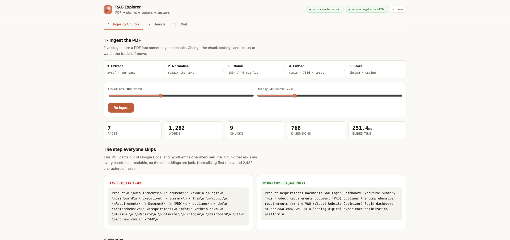
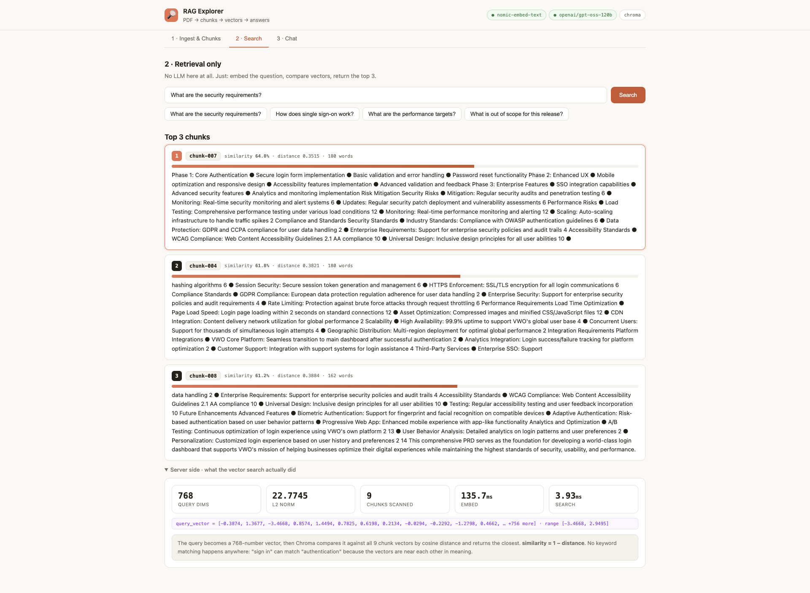
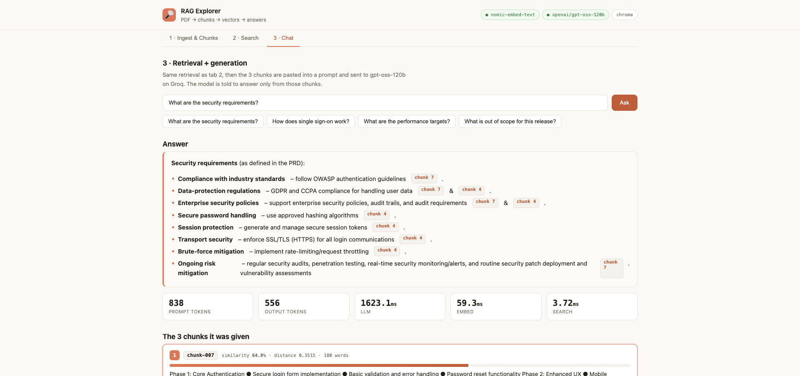

# RAG Explorer

A RAG pipeline you can watch happen. Point it at a PDF and it shows you every stage:
the raw extraction, the repair, the chunks, the 768-number vectors, the similarity
scores, and the exact prompt that reaches the model.

```bash
./run.sh          # http://localhost:5190
```



## What runs where

| Stage | Tool | Where |
|---|---|---|
| Extract | pypdf | local |
| Normalise | regex | local |
| Chunk | word windows + overlap | local |
| Embed | `nomic-embed-text` via Ollama, 768d | **local** |
| Store + search | ChromaDB, cosine | **local** |
| Answer | `openai/gpt-oss-120b` via Groq | remote |

**The document never leaves your machine during ingest.** Embeddings run in Ollama, the
vectors sit in a local Chroma file. Only the 3 retrieved chunks go to Groq, and only when
you use the Chat tab. For a confidential PRD that distinction is the whole point: you can
demo the ingest half with nothing on the wire at all.

## The three tabs

**1 · Ingest & Chunks.** Sliders for chunk size and overlap; re-ingest to see the effect.
Shows the raw vs normalised text side by side, then every chunk with a preview of its vector.

**2 · Search.** Retrieval with no LLM involved. Type a question, get the top 3 chunks
ranked by cosine similarity, with the bar chart and the raw scores. Use this to show that
retrieval is just vector maths, not intelligence.

**3 · Chat.** The same retrieval, then the chunks are pasted into a prompt and sent to
gpt-oss-120b. You get the answer, the token counts, the 3 chunks it was given, and the
verbatim prompt.



## The normalisation step

The bundled PRD was exported from Google Docs, and pypdf returns **one word per line**:

```
Product\n \nRequirements\n \nDocument:\n \nVWO\n \nLogin\n \nDashboard
```

Chunk that as-is and every chunk is a column of disconnected words, which embeds into
noise, which makes retrieval useless. The normaliser detects the pattern (more than 60%
of lines holding a single token) and rejoins the text. On this file it removes 2,432
characters of junk.

This is the least glamorous step in RAG and the one most likely to quietly ruin a demo.
The UI shows before and after so it is visible rather than assumed.

## Reading the numbers

- **similarity = 1 − cosine distance.** Chroma is created with `hnsw:space: cosine`.
- **60% similarity is a good match here**, not a poor one. Nomic embeddings on prose
  rarely exceed ~0.7 for a short question against a 180-word chunk. Judge hits by their
  ranking relative to each other, not against an absolute bar.
- **9 chunks from 1,282 words** at 180-word windows with 40 overlap, so each window
  advances 140 words.
- Embedding a query takes ~40-160ms, the vector search ~2-7ms, and the LLM ~1.5s. Retrieval
  is not your bottleneck.



## Things worth demonstrating

**Semantic beats keyword.** Search "how do users sign in" and the top chunk talks about
*authentication*. No word in common.

**Chunk size is a real trade-off.** Drop to 60 words: more chunks, sharper scores, but
answers get truncated mid-thought. Push to 400: each chunk holds full context but retrieval
gets vague because one vector now averages too many ideas.

**Grounding actually holds.** Ask something the PRD does not cover, like "what is the
pricing?", and the model says it is not in the context instead of inventing a number. That
behaviour comes from the system prompt in `server/app.py`, not from the model being nice.

## Layout

```
01_RAG_Explorer/
├── run.sh              # starts ollama, backend, frontend
├── .env                # GROQ_API_KEY (git-ignored)
├── data/*.pdf          # drop any PDF here; the first one is used
├── server/app.py       # the whole pipeline, one file, ~330 lines
└── ui/src/App.jsx      # three tabs
```

`server/app.py` is deliberately one file. You should be able to read the entire pipeline
top to bottom without following imports.

## Requirements

- Ollama with `nomic-embed-text` (`ollama pull nomic-embed-text`, 274 MB)
- Python 3.10+
- Node 18+
- `GROQ_API_KEY` in `.env` (only needed for tab 3)
